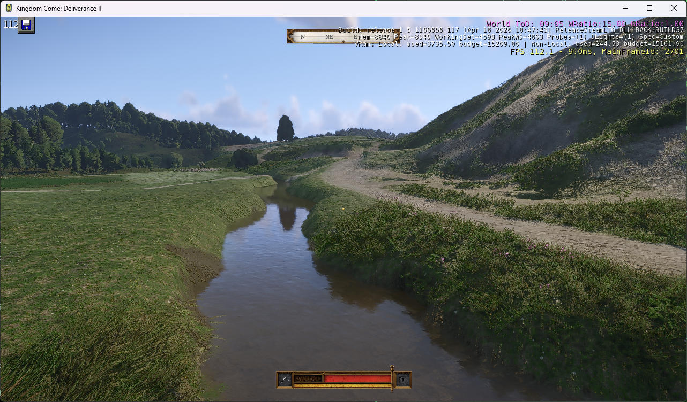

# KingdomComeGlueMapper

**Bring Kingdom Come: Deliverance terrain and vegetation into the Kingdom Come: Deliverance II engine.**

[](https://github.com/SamG-Coder/KingdomComeGlueMapper/actions/workflows/validate.yml)
[](https://www.python.org/)
[](LICENSE)



*Actual in-game capture of the confirmed v17 build: KCD1 terrain, original ground materials, trees, merged ground cover and water geometry running in KCD2. Water uses the native KCD2 river material and an explicit daytime reflection cubemap. Buildings are not yet converted. The debug FPS is from this incomplete world, not a full-game benchmark.*

KingdomComeGlueMapper is an experimental Python converter that reads **compiled files from your installed games** and builds a separate test level for the official KCD2 Modding Tools. Raw editor source is not required by this workflow.

Terrain, original close-up materials, individual vegetation, merged grass / ground cover, and water are working in game. The development launcher places the player near the starting town of **Skalitz** with no-collision flight enabled.

## What works today

| Component | Status |
|---|---|
| Compiled terrain conversion | KCD1 terrain version 28 → KCD2 version 29 |
| World height and layout | 5,461 nodes and 17,139,968 samples checked |
| Sector continuity | 519,488 shared-boundary comparisons; largest mismatch under 5 cm |
| Original terrain materials | All 26 material paths resolve in the runtime |
| Close-up textures | Visually confirmed soil and grass detail |
| HD texture inputs | 78 texture families, with installed HD overrides and streamed mip files |
| Test launcher | Terrain-height spawn, Skalitz default, no-collision flight, intro-skip settings |
| Texture transitions | Optional softer-blending experiment; original transition fidelity not established |
| Individual vegetation | 541,465 original instances / 226 meshes; trees and distant forest visually confirmed |
| Merged grass / ground cover | 25,405,423 samples / 83,431 cells / 169 groups; v13 confirmed working in game |
| Water volumes | 282 original volumes; v17 appearance and reflections confirmed with native KCD2 water material and daytime cubemap |
| Buildings, road objects, NPCs and quests | Not converted |

This is a **terrain-porting prototype**, not a complete game port. Visible gaps, material transitions and missing world objects are still under investigation. Highest-resolution mip residency and walking collision have not been comprehensively validated.

## Requirements

- Windows and **Python 3.11 or newer**. The tools use the Python standard library.
- Installed copies of both games.
- Official **KCD2 Modding Tools**, with workspace setup completed and access to the KCD2 game assets.
- Space for separate generated level packages and material assets. The current material bundle is approximately 234 MB; loose runtime assets take an additional copy.

The default Steam library is `D:\SteamLibrary\steamapps\common`, containing:

```text
KingdomComeDeliverance/
KingdomComeDeliverance2/
KCD2Mod/
```

The tools target the observed `rataje` → `trosecko` compiled formats and 4096 m terrain layout. They are not a general CryEngine converter, and other game builds may need adjustments.

## Quick start

Clone this repository, open PowerShell in its directory, and build the visually confirmed material configuration:

```powershell
git clone https://github.com/SamG-Coder/KingdomComeGlueMapper.git
cd KingdomComeGlueMapper

python tools/upgrade_map.py --original-materials --output 'D:\SteamLibrary\steamapps\common\KCD2Mod\Data\Levels\kcd1_terrain_v6'
python tools/verify_compiled_conversion.py --level kcd1_terrain_v6
python tools/launch_probe.py --level kcd1_terrain_v6
```

Close any running Kingdom Come instance before launching. The builder refuses to overwrite an existing level or asset namespace; use a new output name for another experiment.

The launcher waits for the level and player, queries terrain elevation, and places the player above the ground at **X 734.89313, Y 3421.4497**. These coordinates come from an original scene marker beside Henry's opening conversation with his mother in Skalitz; they are not a verified exact bed-spawn position.

No-collision flight is on by default. Use `--walk` for a traversal test, or `--attach --level <current-level>` to reapply spawn and flight settings to an already running test. `--x`, `--y` and `--clearance` override the spawn position.

Intro-skip settings are passed to the development runtime. They are recognized by the engine, but skipping every startup video has not been visually verified.

### A different Steam library

Supply the library and workspace paths explicitly:

```powershell
python tools/upgrade_map.py --library 'E:\SteamLibrary\steamapps\common' --original-materials --output 'E:\SteamLibrary\steamapps\common\KCD2Mod\Data\Levels\kcd1_terrain_v6'
python tools/verify_compiled_conversion.py --library 'E:\SteamLibrary\steamapps\common' --level kcd1_terrain_v6
python tools/launch_probe.py --tools 'E:\SteamLibrary\steamapps\common\KCD2Mod' --level kcd1_terrain_v6
```

### Softer texture transitions

For a separate comparison build:

```powershell
python tools/upgrade_map.py --original-materials --terrain-blend-factor 1 --output 'D:\SteamLibrary\steamapps\common\KCD2Mod\Data\Levels\kcd1_terrain_v7'
python tools/launch_probe.py --level kcd1_terrain_v7
```

This adjusts material transition shading while preserving terrain geometry, surface assignments, texture inputs and UV scales. It does **not** reconstruct missing original blend masks. The launcher defaults to v6, the screenshot-confirmed material checkpoint.

## How the conversion works

### Vegetation conversion (experimental)

The working **v11** build restores **541,465 individual vegetation instances**
across **226 meshes**, including original trees and shrubs. The user confirmed
visible nearby trees and distant forest in the [v11 screenshot](docs/images/kcd1-vegetation-in-kcd2.png). The exported
HLOD stream contains 3,980 spatial vegetation sectors, and all 226 models loaded
without isolated-asset load errors in the captured runtime log.

The converter reads original position, scale and rotation, rewrites embedded
absolute and relative material references in CGF files, preserves available LODs,
and packages streamed texture families under an isolated namespace. Normal-map
filename suffixes are preserved because the engine uses them to identify texture
semantics. Terrain geometry and surface samples are unchanged from v6.

An important format difference: the initial small probe put instances in the
terrain object tree, but no vegetation was visible. The working build puts them
in KCD2's **`terrain/hlods.dat` and `terrain/hlods.xml`** structure instead. The
record layout was checked against 4,669,105 native vegetation records and 171,333
brush records; generated XML offsets and instance counts are also validated.

After building the v6 terrain/material baseline:

```powershell
python tools/build_vegetation_probe.py --level kcd1_vegetation_v11 --all
python tools/launch_probe.py --level kcd1_vegetation_v11 --x 748 --y 3427
```

`--all` includes every decoded individual instance whose mesh is under the
original vegetation path. Without it, the tool builds a small two-species patch.
This is not complete individual vegetation coverage: the reader decodes leading
vegetation records in each source block and stops at unsupported record types.
Distant proxy atlases, advanced wind behaviour and exhaustive collision/LOD
validation remain unfinished.

#### Merged grass and ground cover (v13 confirmed working)

```powershell
python tools/build_vegetation_probe.py --level kcd1_groundcover_v13 --all --merged
python tools/launch_probe.py --level kcd1_groundcover_v13 --x 748 --y 3427
```

`--merged` converts all **25,405,423 compact merged samples**, covering **83,431
cells and 169 vegetation groups**, alongside the individual vegetation selected
by `--all`. It preserves the original 12-byte position/scale/rotation records,
combines the two legacy sector parts, emits KCD2-shaped merged render nodes in
the terrain octree, and writes matching geometry identifiers into the descriptors
and sector streams. Models, materials and streamed textures use the same isolated
asset packaging as the individual vegetation build.

The user confirmed **v13 merged grass and ground cover working in game**. This
remains a prototype: comprehensive checks of every group, visibility bounds, LODs
and wind behaviour are still outstanding. The screenshot above shows the subsequent **v17 water build**, including merged ground cover.

The local v13 level completed loading and confirmed terrain-based spawn with
no-collision flight. Every packaged sector was checked against its octree group
descriptors; all 83,431 cell counts and geometry identifiers matched. The runtime
also reports missing item database definitions for three namespaced plant models;
harvesting/respawn gameplay is not converted.

Assets are installed under `KCD2Mod/Data/glueveg/<level>/`. The vegetation level
also depends on the base level's terrain-material namespace; keep those assets
installed. Source game assets and generated outputs are not distributed here.
The default launcher remains on the terrain-only v6 checkpoint; select v11
explicitly as above.

Asset-free binary checks: `python -m unittest discover -s tests -v`.

### Water conversion (v17 confirmed working)

The user confirmed water appearance and reflections working in the v17 build,
shown in the screenshot above. Build on the existing v13 ground-cover level:

```powershell
python tools/build_water_probe.py --base-level kcd1_groundcover_v13 --level kcd1_water_v17 --native-water-materials
python tools/launch_probe.py --level kcd1_water_v17 --x 730 --y 3270 --clearance 5
```

This converts **282 original water volumes**: 197 area polygons and 85 river
segments. Original surface and physics-contour coordinates, volume IDs, fog
settings, depth and flow speed are preserved. The 57 source material-less volumes
remain material-less. The existing terrain and vegetation are retained.

The confirmed configuration uses `--native-water-materials` to bind the installed
KCD2 river material. The original global environment probe is restored with an
explicit installed KCD2 **07:00 cubemap**. This avoids the missing texture fallback
from an empty dynamic probe path in a newly generated level. The cubemap is a
**fixed daytime fallback**; the original day/night probe sequence and local baked
probes have not been converted.

Omitting `--native-water-materials` retains the experimental conversion of seven
original water materials, packaging textures under `KCD2Mod/Data/gluewater/<level>/`.
That path translates shader features into both named features and numeric masks
using the installed target definitions. Named features alone did not activate
reflections in this runtime. The original-material path is not the visually
accepted v17 configuration.

Validation covers the complete source and native object streams, including road
record strides needed to locate water safely. All 282 surface/physics-contour
payloads were compared byte for byte, and the two new auxiliary defaults match
all 115 installed native water volumes. The runtime confirmed level load, fly
mode and an active probe with the explicit cubemap bound. The asset-free suite
contains 14 tests. Swimming, full flow behaviour and exhaustive shoreline checks
remain unverified. Keep the base terrain and vegetation asset namespaces installed.

### Terrain and materials pipeline

1. Read compiled terrain and level metadata from the installed KCD1 `rataje` archives.
2. Validate the observed binary layout and compare it with installed KCD2 data.
3. Convert the node headers, height/surface packing and geometry-error layout.
4. Rebuild the minimal runtime level and mission documents, leaving outdoor objects explicitly empty.
5. Optionally package the original terrain materials and all referenced DDS families, overlaying installed HD files on their base assets.
6. Verify sample preservation, sector boundaries and material dependencies before testing in the target runtime.

A key discovery was that the installed KCD1 height samples already use **fixed 5 cm increments**, despite a legacy variable-range value remaining in their headers. Using that legacy range produced steps up to 46.2 m between sectors. Fixed-step decoding restored continuous terrain and matched live target-engine height queries.

Terrain material feature masks are translated through named shader features instead of copying numeric masks across engine versions. Texture dependencies include numbered streaming mips and split alpha/gloss files; copying the base DDS alone is insufficient.

## Generated files and isolation

The converter writes a new level under `KCD2Mod/Data/Levels/<name>`, plus an `upgrade-report.json`. Material builds also create:

```text
KCD2Mod/Data/gluemapper_<name>.pak
KCD2Mod/Data/gluemapper/<name>/
```

The loose namespace is required by the tested development runtime: placing an arbitrary archive in `Data` did not automatically make its materials available. Every asset reference is namespaced to avoid replacing official materials or textures.

Retail archives and the modding workspace's retail symlinks are not modified. To remove a test, close the game and remove only its generated level directory, matching `gluemapper_<name>.pak`, and matching `gluemapper/<name>` directory. Keep any output still used by another test.

## Tools and validation

| Tool | Purpose |
|---|---|
| `tools/audit_maps.py` | Read-only archive inventory and bounded header inspection |
| `tools/compiled_terrain.py` | Terrain parser and elevation converter |
| `tools/upgrade_map.py` | Build an isolated compiled test level |
| `tools/terrain_materials.py` | Resolve, namespace, package and verify texture dependencies |
| `tools/verify_compiled_conversion.py` | Check every height/surface sample and shared sector boundaries |
| `tools/build_vegetation_probe.py` | Build original vegetation instances and KCD2 HLOD metadata |
| `tools/vegetation.py` | Bounded vegetation/HLOD readers and instance conversion |
| `tools/launch_probe.py` | Launch the development runtime and apply spawn/flight settings |
| `tools/build_water_probe.py` | Build original water volumes with the confirmed native-material option |
| `tools/water_volumes.py` | Bounded object-stream reader and water record conversion |
| `tools/stage_map_probe.py` | Historical unconverted-copy diagnostic; not needed for normal use |

Local checks require your installed game files. GitHub Actions checks Python compilation, CLI entry points and asset-free vegetation binary tests on Windows; it does **not** run the games or establish runtime compatibility.

See [development notes](docs/development-notes.md) for the experiment history and observed format differences. Local logs, reports, extracted engine references and generated assets are intentionally excluded from this repository.

## Roadmap

**Current milestone: vegetation.** Individual vegetation is now rendering in KCD2, with a world-wide v11 build and a visual confirmation near Skalitz. Merged grass and ground cover are also confirmed working in the v13 build. Remaining work includes broader merged-sector checks, proxy/LOD behaviour, wind, collision and placement validation.

1. **Read the vegetation data.** Trace species definitions, placed instances and merged vegetation records in the compiled KCD1 packages, and compare their representation with KCD2.
2. **Convert one representative patch.** Resolve a few tree, shrub and ground-cover assets with their materials and texture dependencies. Preserve source positions, rotation and scale wherever the compiled data provides them.
3. **Validate in game.** Check terrain alignment, foliage transparency, lighting, shadows, collision where applicable, and visibility at near and far distances. Test LOD transitions and streaming before increasing the instance count.
4. **Expand across the world.** Extend the converter to the remaining vegetation types and merged vegetation data, measuring performance as coverage grows.

The first rendering checkpoint is confirmed: original vegetation is visible near Skalitz in a reproducible build. Stable distance transitions, complete coverage and collision still require further validation. A resource-table scan or successful asset extraction alone does not complete those checks.

**Water milestone: v17 confirmed working.** Original water geometry now renders with native KCD2 water materials and a valid daytime reflection fallback. Remaining water work includes the day/night probe sequence, local probes, swimming and broader shoreline/flow validation. Next world-conversion steps are Skalitz buildings and other placed objects, remaining terrain gaps and material transitions, and road geometry. Walking/collision and world-streaming validation precede NPCs, navigation and quests.

## License and game content

The original Python tooling is released under the [MIT license](LICENSE). Game content, trademarks and the in-game screenshot belong to their respective rights holders and are not covered by that code license.

No game archives, extracted textures, meshes, engine source or generated level packages are distributed here. The converter reads assets from your own installations. This is an independent experimental project, not an official Warhorse Studios or publisher release.
