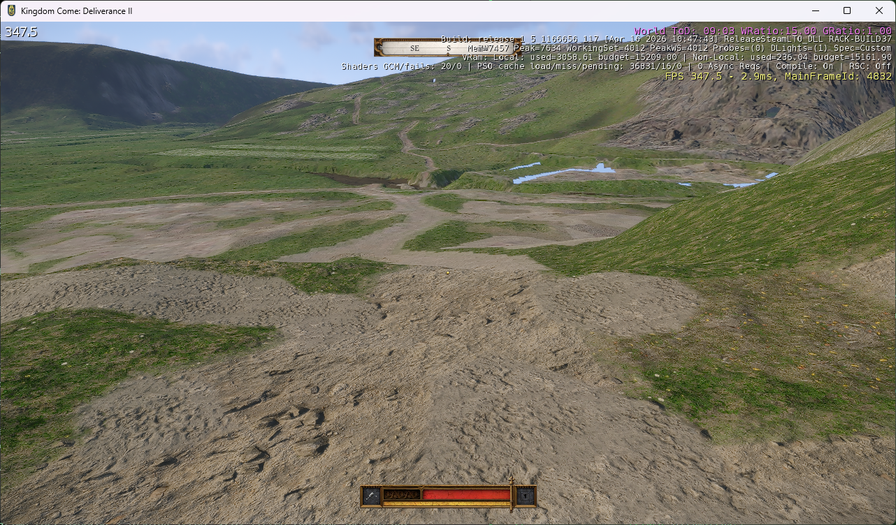

# KingdomComeGlueMapper

**Bring Kingdom Come: Deliverance terrain into the Kingdom Come: Deliverance II engine.**

[](https://github.com/SamG-Coder/KingdomComeGlueMapper/actions/workflows/validate.yml)
[](https://www.python.org/)
[](LICENSE)



*Actual in-game capture of the converted KCD1 world in KCD2, near Skalitz. Original terrain detail textures are loaded; buildings, trees and other world objects are not yet converted. Pale terrain gaps remain visible. The debug FPS is from this stripped terrain test, not a full-world performance benchmark.*

KingdomComeGlueMapper is an experimental Python converter that reads **compiled files from your installed games** and builds a separate test level for the official KCD2 Modding Tools. Raw editor source is not required by this workflow.

The first milestone is working: KCD1 terrain renders in KCD2, original close-up materials load, and the development launcher places the player near the starting town of **Skalitz** with no-collision flight enabled.

## What works today

| Component | Status |
|---|---|
| Compiled terrain conversion | KCD1 terrain version 28 → KCD2 version 29 |
| World height and layout | 5,461 nodes and 17,139,968 samples checked |
| Sector continuity | 519,488 shared-boundary comparisons; largest mismatch under 5 cm |
| Original terrain materials | All 26 material paths resolve in the runtime |
| Close-up textures | Visually confirmed soil and grass detail |
| HD texture inputs | 78 texture families, with installed HD overrides and streamed mip files |
| Test launcher | Terrain-height spawn, Skalitz default, no-collision flight, intro-skip settings |
| Texture transitions | Optional softer-blending experiment; original transition fidelity not established |
| Buildings, vegetation, road objects, water, NPCs and quests | Not converted |

This is a **terrain-porting prototype**, not a complete game port. Visible gaps, material transitions and missing world objects are still under investigation. Highest-resolution mip residency and walking collision have not been comprehensively validated.

## Requirements

- Windows and **Python 3.11 or newer**. The tools use the Python standard library.
- Installed copies of both games.
- Official **KCD2 Modding Tools**, with workspace setup completed and access to the KCD2 game assets.
- Space for separate generated level packages and material assets. The current material bundle is approximately 234 MB; loose runtime assets take an additional copy.

The default Steam library is `D:\SteamLibrary\steamapps\common`, containing:

```text
KingdomComeDeliverance/
KingdomComeDeliverance2/
KCD2Mod/
```

The tools target the observed `rataje` → `trosecko` compiled formats and 4096 m terrain layout. They are not a general CryEngine converter, and other game builds may need adjustments.

## Quick start

Clone this repository, open PowerShell in its directory, and build the visually confirmed material configuration:

```powershell
git clone https://github.com/SamG-Coder/KingdomComeGlueMapper.git
cd KingdomComeGlueMapper

python tools/upgrade_map.py --original-materials --output 'D:\SteamLibrary\steamapps\common\KCD2Mod\Data\Levels\kcd1_terrain_v6'
python tools/verify_compiled_conversion.py --level kcd1_terrain_v6
python tools/launch_probe.py --level kcd1_terrain_v6
```

Close any running Kingdom Come instance before launching. The builder refuses to overwrite an existing level or asset namespace; use a new output name for another experiment.

The launcher waits for the level and player, queries terrain elevation, and places the player above the ground at **X 734.89313, Y 3421.4497**. These coordinates come from an original scene marker beside Henry's opening conversation with his mother in Skalitz; they are not a verified exact bed-spawn position.

No-collision flight is on by default. Use `--walk` for a traversal test, or `--attach --level <current-level>` to reapply spawn and flight settings to an already running test. `--x`, `--y` and `--clearance` override the spawn position.

Intro-skip settings are passed to the development runtime. They are recognized by the engine, but skipping every startup video has not been visually verified.

### A different Steam library

Supply the library and workspace paths explicitly:

```powershell
python tools/upgrade_map.py --library 'E:\SteamLibrary\steamapps\common' --original-materials --output 'E:\SteamLibrary\steamapps\common\KCD2Mod\Data\Levels\kcd1_terrain_v6'
python tools/verify_compiled_conversion.py --library 'E:\SteamLibrary\steamapps\common' --level kcd1_terrain_v6
python tools/launch_probe.py --tools 'E:\SteamLibrary\steamapps\common\KCD2Mod' --level kcd1_terrain_v6
```

### Softer texture transitions

For a separate comparison build:

```powershell
python tools/upgrade_map.py --original-materials --terrain-blend-factor 1 --output 'D:\SteamLibrary\steamapps\common\KCD2Mod\Data\Levels\kcd1_terrain_v7'
python tools/launch_probe.py --level kcd1_terrain_v7
```

This adjusts material transition shading while preserving terrain geometry, surface assignments, texture inputs and UV scales. It does **not** reconstruct missing original blend masks. The launcher defaults to v6, the screenshot-confirmed material checkpoint.

## How the conversion works

1. Read compiled terrain and level metadata from the installed KCD1 `rataje` archives.
2. Validate the observed binary layout and compare it with installed KCD2 data.
3. Convert the node headers, height/surface packing and geometry-error layout.
4. Rebuild the minimal runtime level and mission documents, leaving outdoor objects explicitly empty.
5. Optionally package the original terrain materials and all referenced DDS families, overlaying installed HD files on their base assets.
6. Verify sample preservation, sector boundaries and material dependencies before testing in the target runtime.

A key discovery was that the installed KCD1 height samples already use **fixed 5 cm increments**, despite a legacy variable-range value remaining in their headers. Using that legacy range produced steps up to 46.2 m between sectors. Fixed-step decoding restored continuous terrain and matched live target-engine height queries.

Terrain material feature masks are translated through named shader features instead of copying numeric masks across engine versions. Texture dependencies include numbered streaming mips and split alpha/gloss files; copying the base DDS alone is insufficient.

## Generated files and isolation

The converter writes a new level under `KCD2Mod/Data/Levels/<name>`, plus an `upgrade-report.json`. Material builds also create:

```text
KCD2Mod/Data/gluemapper_<name>.pak
KCD2Mod/Data/gluemapper/<name>/
```

The loose namespace is required by the tested development runtime: placing an arbitrary archive in `Data` did not automatically make its materials available. Every asset reference is namespaced to avoid replacing official materials or textures.

Retail archives and the modding workspace's retail symlinks are not modified. To remove a test, close the game and remove only its generated level directory, matching `gluemapper_<name>.pak`, and matching `gluemapper/<name>` directory. Keep any output still used by another test.

## Tools and validation

| Tool | Purpose |
|---|---|
| `tools/audit_maps.py` | Read-only archive inventory and bounded header inspection |
| `tools/compiled_terrain.py` | Terrain parser and elevation converter |
| `tools/upgrade_map.py` | Build an isolated compiled test level |
| `tools/terrain_materials.py` | Resolve, namespace, package and verify texture dependencies |
| `tools/verify_compiled_conversion.py` | Check every height/surface sample and shared sector boundaries |
| `tools/launch_probe.py` | Launch the development runtime and apply spawn/flight settings |
| `tools/stage_map_probe.py` | Historical unconverted-copy diagnostic; not needed for normal use |

Local checks require your installed game files. GitHub Actions checks Python compilation and CLI entry points on Windows; it does **not** run the games or establish runtime compatibility.

See [development notes](docs/development-notes.md) for the experiment history and observed format differences. Local logs, reports, extracted engine references and generated assets are intentionally excluded from this repository.

## Roadmap

- Resolve terrain gaps and validate surface transitions against the original game.
- Restore a small group of Skalitz buildings and verify mesh/material placement.
- Convert the remaining object and HLOD data, then vegetation, roads and water.
- Validate walking, collision and world streaming before considering gameplay systems.

## License and game content

The original Python tooling is released under the [MIT license](LICENSE). Game content, trademarks and the in-game screenshot belong to their respective rights holders and are not covered by that code license.

No game archives, extracted textures, meshes, engine source or generated level packages are distributed here. The converter reads assets from your own installations. This is an independent experimental project, not an official Warhorse Studios or publisher release.
